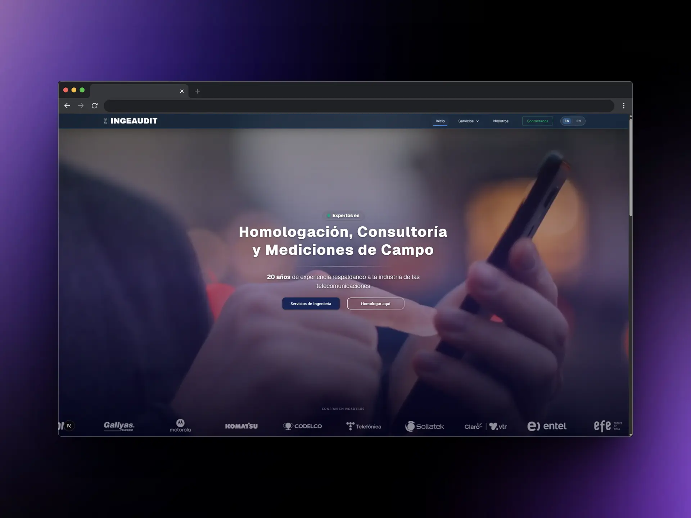

# Ingeaudit Ltda. - Sitio Web Corporativo

> Repositorio oficial para el desarrollo del nuevo sitio web corporativo de Ingeaudit Ltda.

Este proyecto tiene como objetivo construir una presencia digital moderna, rápida y profesional para Ingeaudit, utilizando las últimas tecnologías de desarrollo web frontend. El enfoque se centra en el rendimiento, la experiencia de usuario y una arquitectura escalable y mantenible.


*Estado actual del desarrollo (Navegación y Layout base).*

## Stack Tecnológico

El proyecto está construido sobre un stack moderno y robusto. Es fundamental adherirse a las convenciones de estas tecnologías.

* **Framework Core:** [Next.js 15 (App Router)](https://nextjs.org/docs) - Para renderizado híbrido, rutas y optimización.
* **Lenguaje:** [TypeScript](https://www.typescriptlang.org/) - Tipado estático para mayor robustez y mejor experiencia de desarrollo.
* **Librería UI:** [React](https://react.dev/) - Construcción de interfaces basadas en componentes.

* **Estilos:**


    * [Tailwind CSS](https://tailwindcss.com/) - Framework de utilidades integrado por defecto para un estilizado ágil y consistente.

    * [CSS Modules](https://github.com/css-modules/css-modules) - Estilos encapsulados por componente, complementado con variables CSS globales.
* **Gestor de Paquetes:** [pnpm](https://pnpm.io/) - Para una instalación de dependencias rápida y eficiente en disco.

## Prerrequisitos

Antes de comenzar, asegúrate de tener tu entorno configurado correctamente para evitar discrepancias.

1.  **Node.js:** Se requiere la versión **v20 LTS** o superior (recomendado usar `nvm` para gestionar versiones).
    ```bash
    node -v
    # Debería mostrar v20.x.x o superior
    ```
2.  **pnpm:** Utilizamos `pnpm` exclusivamente para asegurar que todos trabajemos con el mismo árbol de dependencias (gracias al `pnpm-lock.yaml`).
    ```bash
    # Si no lo tienes instalado:
    npm install -g pnpm
    ```

## Primeros Pasos (Instalación)

Sigue estos pasos para levantar el entorno de desarrollo local:

1.  **Clonar el repositorio:**
    ```bash
    git clone <URL_DEL_REPOSITORIO>
    cd ingeaudit-web
    ```

2.  **Instalar dependencias:**
    Es crucial usar `pnpm` y no `npm` o `yarn`.
    ```bash
    pnpm install
    ```

3.  **Iniciar el servidor de desarrollo:**
    ```bash
    pnpm dev
    ```

Abre [http://localhost:3000](http://localhost:3000) en tu navegador. El servidor cuenta con Hot Module Replacement (HMR), por lo que los cambios se reflejarán instantáneamente.

## Estructura del Proyecto (Next.js App Router)

Utilizamos la estructura de carpetas de Next.js 14+ (App Router). Es vital entender dónde va cada pieza de código.

...


...

## Guías de Colaboración y Flujo de Trabajo

Para mantener la calidad del código y facilitar el trabajo en equipo, seguimos estas reglas estrictas.

### 1. Flujo de Git (Git Workflow)

* **Rama Principal:** `main` es la rama de producción. **Nunca** se hace commit directamente en `main`.
* **Ramas de Funcionalidad:** Crea una nueva rama para cada tarea o sección que desarrolles.
* **Convención de Nombres de Rama:** Usa prefijos claros:
    * `feat/nombre-seccion`: Para nuevas características (ej: `feat/seccion-servicios`).
    * `fix/descripcion-bug`: Para corrección de errores (ej: `fix/navbar-mobile-overlap`).
    * `style/descripcion`: Para ajustes puramente visuales.
* **Pull Requests (PR):**
    * Al terminar tu tarea, abre un PR hacia la rama `main`.
    * Se requiere la revisión y aprobación de otro miembro del equipo antes de hacer merge.

### 2. Estilos y Diseño

* **CSS Modules:** Usamos `.module.css` para estilos de componentes específicos. Esto evita conflictos de nombres de clases. Usa camelCase para nombrar las clases (ej: `.navContainer` en CSS -> `styles.navContainer` en TSX).
* **Variables Globales:** **PROHIBIDO usar valores hexadecimales (colores) o píxeles "mágicos" directamente en los CSS modules.**
    * Revisa `src/app/globals.css`. Allí están definidas las variables de nuestra paleta de colores (`--brand-primary`, `--bg-surface`, etc.) y espaciado.
    * Ejemplo correcto: `color: var(--brand-primary);`
    * Ejemplo incorrecto: `color: #D4AF37;`

### 3. Componentes y Navegación

* **Componentes Atómicos:** Intenta que los componentes sean pequeños y tengan una sola responsabilidad. Si una sección es muy compleja, divídela en sub-componentes.
* **Navegación:** Usa siempre el componente `<Link href="...">` de Next.js para enlaces internos. **Nunca** uses la etiqueta HTML estándar `<a>`, ya que provoca una recarga completa de la página y rompe la experiencia SPA.

## Scripts Disponibles

Referencia rápida de los comandos en `package.json`:

| Comando | Descripción |
| :--- | :--- |
| `pnpm dev` | Inicia el servidor de desarrollo en modo local. |
| `pnpm build`| Compila la aplicación para producción (genera la carpeta `.next`). |
| `pnpm start`| Inicia el servidor de producción localmente (requiere ejecutar `build` primero). |
| `pnpm lint` | Ejecuta ESLint para analizar el código en busca de errores y problemas de estilo. |

---

**Equipo de Desarrollo Ingeaudit Ltda.**
*Documento actualizado: Enero 2026*